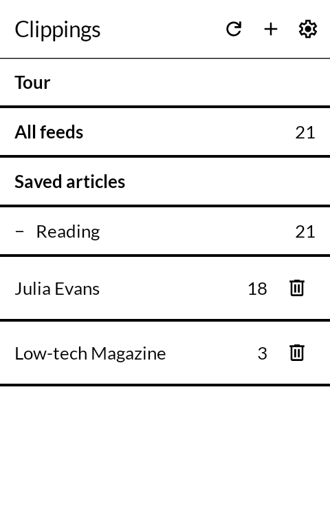
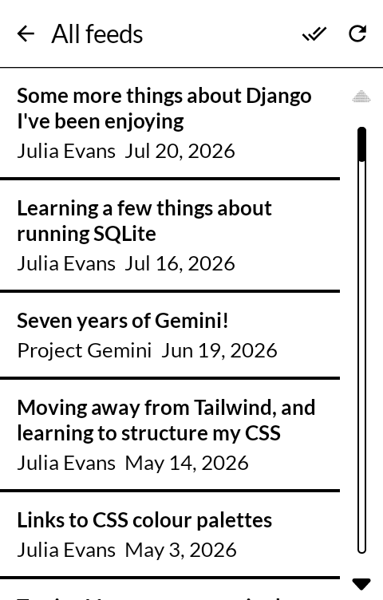
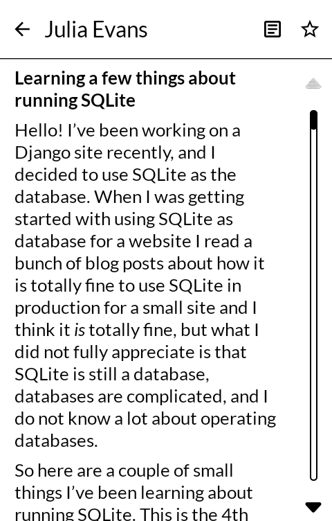

# 切抜 kirinuki — Clippings

A feed reader for the [Mudita Kompakt](https://mudita.com/products/kompakt/), built for its
E Ink screen: text on paper, no images, and everything kept on the phone.

*Kirinuki* is 切抜 — a cutting, the thing you take out of a newspaper with scissors and
keep. 切 (to cut), 抜 (to take out). It is what this is: pieces cut from somewhere else and
kept, most of them only as much as the paper gave you.

Fork of [Feeder](https://github.com/spacecowboy/Feeder) by
[Jonas Kalderstam](https://github.com/spacecowboy), pared to a reader and rebuilt on
Mudita's MMD design system.

| | |
|---|---|
|  |  |
|  |  |

## What it is

Three screens. The feeds, what is in one, and the thing itself.

- **No account, and no server of ours.** Feeds are fetched straight from the sites that
  publish them. Nothing is registered and nothing phones home.
- **Read with the radio off.** Everything is fetched on wifi and stored; the reading
  afterwards needs nothing.
- **Text only.** No images, no embedded web view. A photograph at sixteen greys costs a
  redraw to say less than the headline did, and a page that drags in a site's own CSS is
  unreadable on this screen.
- **OPML in and out.** How you arrive with feeds, and how you leave with them.
- **Volume keys page the article**, because dragging a finger down E Ink is a poor way to
  read.

## What it will not do for you

Most feeds carry a summary rather than the whole article. Clippings will fetch the full
text from the page and keep it beside the summary — and that fetch is genuinely unreliable,
because it depends on a stranger's markup. When it fails, the screen says so and gives you
back the summary. It does not show you half an article as though it were whole.

## Installing it

The APK is on the [releases page](https://github.com/wanderwildwood/kirinuki/releases/latest).

```sh
curl -LO https://github.com/wanderwildwood/kirinuki/releases/latest/download/kirinuki.apk
curl -LO https://github.com/wanderwildwood/kirinuki/releases/latest/download/kirinuki.apk.sha256
sha256sum -c kirinuki.apk.sha256
adb install kirinuki.apk
```

Or point [Obtainium](https://github.com/ImranR98/Obtainium) at this repository and let it
track releases. Choose `kirinuki.apk` rather than `kirinuki-v*.apk` when it asks: the fixed
name keeps working after the next release.

Android 12 (API 31) or newer.

## Building it

```sh
./gradlew :app:assembleDebug     # or :app:assembleRelease
```

MMD comes from Mudita's own Artifactory repository, which is already declared in
`settings.gradle.kts`.

## What was taken out of Feeder

Feeder is a much larger app, and most of the work here was removal: the OpenAI integration,
the Bergamot translation engine, the device-to-device sync chain, the home screen widget,
read-aloud, the podcast player, image loading, and the bundled fonts. The reader's own
machinery — the feed parsers, the full-text extraction, the HTML-to-text pipeline, the
database — is Feeder's and is the reason this exists at all.

## Credits

- Built on [Feeder](https://github.com/spacecowboy/Feeder) by Jonas Kalderstam (GPL-3.0).
- Full-text extraction via [Readability4J](https://github.com/dankito/Readability4J).
- UI built with Mudita's [MMD](https://github.com/mudita/MMD) component library for Kompakt.

## Support

This is free software and it stays free; there is nothing here to buy. If you would like to
send something somewhere anyway, there are some llamas in Hot Springs, North Carolina who go
through a great deal of hay: <https://hotspringsllamas.org/donate/>

## Licence

GPL-3.0, the same as upstream Feeder. See [LICENSE](LICENSE).
